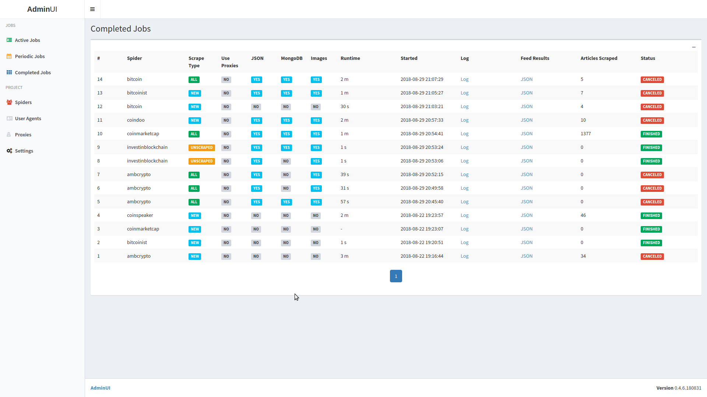

# Bitcoin News Scraper


### Requirements

- docker (>= 1.13)
- docker-compose (>= 1.8)
- MongoDB (optionally)


### Credits

- UI is based on code from [SpiderKeeper](https://github.com/DormyMo/SpiderKeeper) project


### Screenshot




### Building the docker image

Go to project directory.
```
cd bns/
```
Build docker image
```
docker-compose build
```

### Running the docker container

From the project directory execute and wait ~20 secs for all services to boot up
```
docker-compose up
```
Stop the docker container with CTRL+C or CTRL+BREAK or CMD+C (OS X). Wait around 10 secs for all services to stop running. Make sure there are no running scrape jobs when stopping the container to avoid possible data corruption.

### Usage

Make sure that port 5000 is free before running the docker.
Administration is done through web panel (AdminUI).
Navigate to http://localhost:5000/ or http://127.0.0.1:5000/ in your browser.

### Configuration

First setup your MongoDB connection details, go to Settings section in the AdminUI, and set up the
*Connection URI* and optionally *DB name* to your preferred DB name.
You can change other scrape related settings from here but most of these settings can be changed also
during the creation of scrape jobs.

### Scrape job

Go to *Spiders* section, select at least one spider and click *Run*. You can change default settings
(scrape type, results save target and proxy usage) for current job.

#### Periodic Scrape Job

Go to *Periodic jobs* section, select at least one spider and click *Add Periodic Job*. Adjust scrape details and choose pause time between two scrapes. Periodic job for each spider will spawn one regular
scrape job after each repeat time/delay end.
Take note: periodic jobs are run in delay->job->delay->job... order.

#### Saving scraped data

###### JSON

Data is saved to bns/results/feeds/SPIDERNAME.json

###### MongoDB

Data is by default stored in *bitcoin_news* database, *Articles* collection.
MongoDB database files are stored in data/mongo directory. Replica set files are stored in data/mongo2 and data/mongo3 directories.
It is recommended to change provided keyfile. From project directory issue (on *nix compatible OS-es):
```
openssl rand -base64 756 > config/mongo.keyfile
chmod 400 config/mongo.keyfile
```

###### Images

Images are stored in bns/results/images/SPIDERNAME/full/.

#### Avoiding scraper blocking

###### User agents

Scraper automatically loads the user agent list from data/user_agents.txt, and changes user agent for every request. You can change list of user agents from the *User Agents* section.

###### Proxies

List of proxies is located in data/proxies.txt, one proxy per line in format:
```
PROTOCOL://HOST:PORT/
```
Example proxy list:
```
http://127.0.0.1:80/
http://127.0.0.1:8080/
http://127.0.0.1:8888/
```
You can change proxies from the *Proxies* section.
Each proxy will be disabled/removed after number of retries. If there are no valid proxies, spider will stop scraping.


###### Delays

Change delay between scrape requests.

#### Reliability

Sometimes scrapes will fail because of connection issues or because target server is down or overloaded. Lower these values to increase speed and decrease reliability or increase them get less speed but more reliable scraping.

###### Retries

Change number of scrape attempts on one url after failed scrape before giving up.

###### Timeout

Number of seconds before giving up or another retry.


#### Scrape mode

Default scraping mode is to try to scrape the all articles.
Scrape new will try to fetch the most recent ones (all articles from categories first page).
Spider will try to scrape from all collected article urls for which there are no data stored in chosen target storage (JSON and/or MongoDB).


#### Twitter

To harvest Twitter data files data/twitter_usernames.txt and data/twitter_keywords.txt needs to be populated, one item per line. To access API auth details
should be provided from Settings->Twitter API page in webUI.
